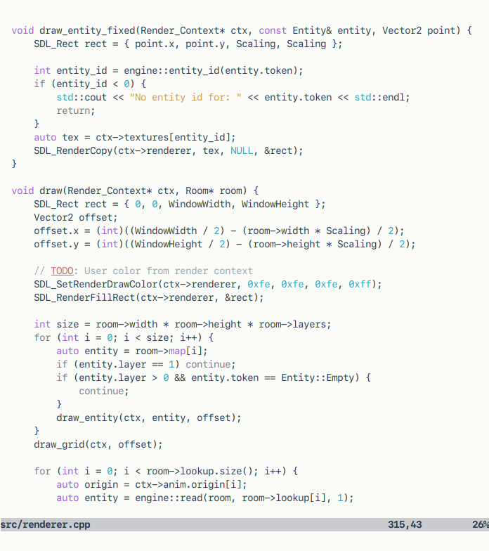
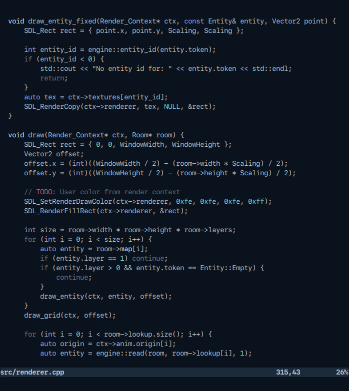

# Nebula

A simple and cozy vim color scheme. Supports both true color and 256 color terminals, in light or dark variants.

## Screenshots




## Installation

Place `nebula.vim` into your `~/.vim/colors` directory, or simply use a plugin manager like [Plug](https://github.com/junegunn/vim-plug):

```VimL
Plug 'stillwwater/vim-nebula'
```

## Usage

Light:

```VimL
set background=light
colorscheme nebula
```

Dark:

```VimL
set background=dark
colorscheme nebula
```

Enable true color for more accurate colors:

```VimL
if has('termguicolors')
  set termguicolors
endif
```

---

Based on the [paramount](https://github.com/owickstrom/vim-colors-paramount) color scheme.
